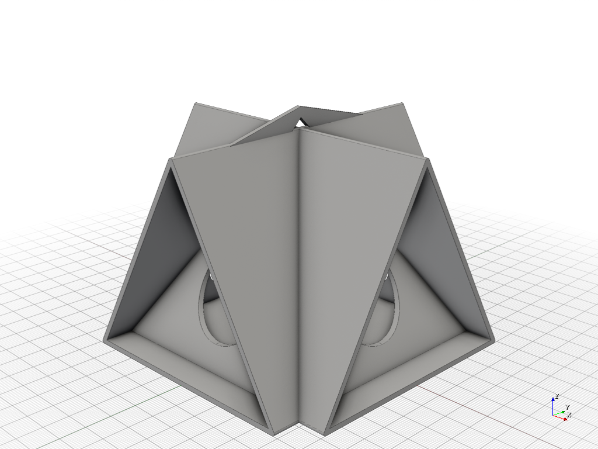
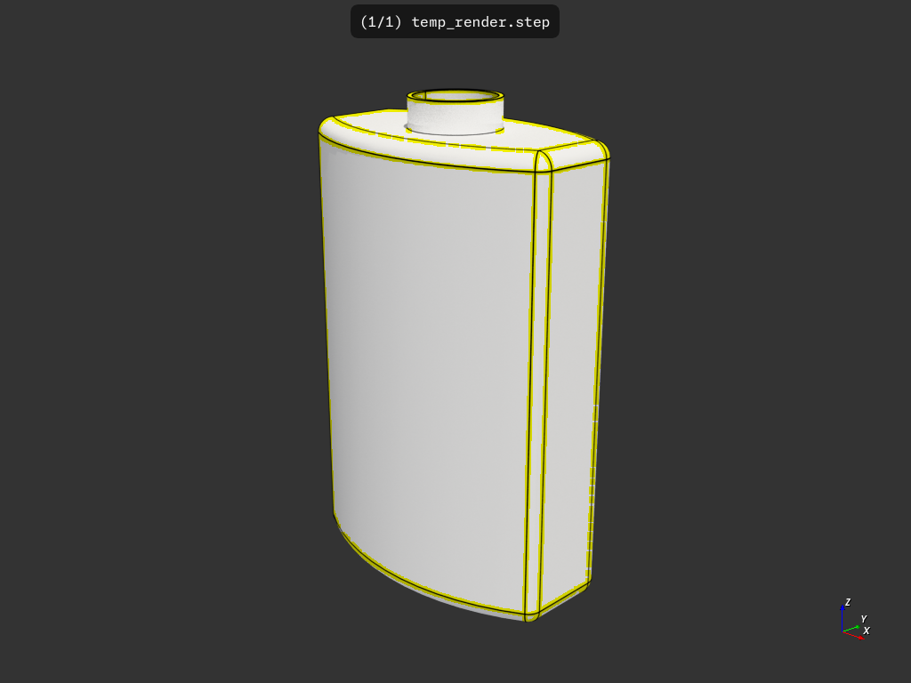

# build123d-f3d-render

Headless automatic rendering of build123d models using f3d -- updates renders on any script changes (pushes) to this repository (or any forks)

### How this repo works:

0. This repo contains github workflows that setup f3d and build123d in a github runner. This repo also contains a few example models under example-model*/.
1. On pushes the github workflow (render_f3d.yml) executes a python script (render_f3d.py) which searches recursively for python files and attempts to execute them.
2. The python script looks for a variable `to_export` which should contain an exportable build123d object (e.g. a Solid) and attempts to export that to the STEP file format.
3. The python script executes f3d along with a number of configuration options which creates renders for found objects and saves them to the appropriate subfolder with the same name as the build123d python script (e.g. `model.py` -> `model.png`).
4. The github workflow **commits** via github-actions[bot] the changed PNG images back to this repo which are embedded in the subfolder `README.md` files.

### How to use this repo (ALPHA):

1. Fork the repository
2. Add a subfolder containing:
```
- yourbuild123dscript.py
- README.md (embed the image yourbuild123dscript.png) and any other documentation / info you want to include.
```
3. The github actions will render `yourbuild123dscript.png` and commit it back to the repo in the appropriate subfolder (see above steps).

### Example renders (updated automatically):



